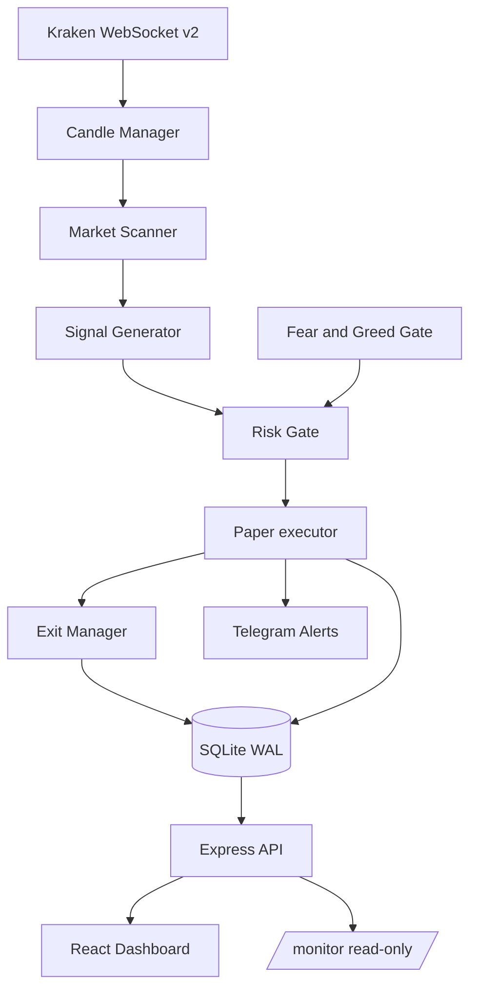

# CryptoTitan

Canadian-universe, paper-first cryptocurrency daytrading engine. It streams Kraken USD markets, scans a fixed ticker set, and manages simulated positions through a single Node process plus a React monitoring dashboard.


This codebase is a hard fork of the CryptoGod engine, retargeted for a **Canadian Kraken USD account**. It is **not** a proven profitable live system. The current configuration exists to gather a forward paper sample under conservative fills, not to trade real capital.

**Intended private remote:** `https://github.com/manijose1919/CryptoTitan`  
**Current public lineage (until the private remote is granted to this agent):** `https://github.com/manijose1919/cryptoGod`

## Risk notice

> This software can place orders on a live cryptocurrency exchange. When live mode is enabled it will buy and sell real assets with real money, automatically, without a human in the loop. Cryptocurrency trading can result in total loss of capital.
>
> Nothing in this repository is financial advice. Corrected fee-aware replay of the current Canadian universe is **approximately break-even** (see Evidence). That is not an edge. Paper profits, if they appear later, still do not predict live returns. The software is provided without warranty; see [`LICENSE`](LICENSE). You are solely responsible for anything it does with your money.

## Current operating posture

| Control | Value |
|---|---|
| Default / deployed mode | `V2_MODE=paper` |
| Live interlock | `V2_MODE=live` **and** `V2_LIVE_CONFIRMED=yes`; otherwise the engine stays **paper** |
| Universe | Ten Kraken USD pairs only: BTC, ETH, XRP, BNB, SOL, ADA, DOGE, LINK, DOT, AVAX |
| Regime gate | `STRONG_UP` only |
| Paper fills | 5 bps adverse slippage per side; gap-aware stop fills |
| Fees modelled | Kraken taker 0.26% per side (0.52% round-trip) |
| ML gatekeeper | **Off** (training path stores exit-time features; no leakage-free OOS skill) |
| Pairs / sniper / mean reversion | **Off** |
| Shorts / staking / arb | **Off**; DCA remains simulation-only |
| Runtime flag mutation | `POST /api/config/flag` requires `ADMIN_API_KEY` |

Do **not** set `V2_LIVE_CONFIRMED=yes` without an explicit human dual-confirmation and a pre-registered promotion rule that this sample has not met.

## Evidence (corrected replay)

Same-bar close fills were **not causal** and must not be used for promotion.

Fee-aware next-bar-open replay, 5 bps/side, `STRONG_UP` only, 4h, ten CAD tickers, 0.52% RT taker:

| Window | Trades | Net | Profit factor | Notes |
|---|---|---|---|---|
| 90d (2026-06-06 → 2026-09-04) | 47 | **-$3.63** | **0.96** | WR 72.3%; avg win $2.79 / avg loss $7.57 |
| First 45d | 17 | -$22.47 | 0.46 | Non-overlapping half |
| Second 45d | 19 | +$7.47 | 1.23 | Non-overlapping half |

**Decision:** stay paper-only. Do not cherry-pick tickers from this sample. Do not reset `stats_baseline_time` until this configuration is actually deployed.

Older CryptoGod figures (mid-cap universes, same-bar fills, enabled MR/sniper) are **not** transferable to this fork.

## Architecture



The ML gatekeeper is present in the tree but **not** in the live decision path while `ML_GATEKEEPER_ENABLED` is false.

### Loop

The main loop lives in `v2/engine/tradeEngine.ts`:

1. **Scan** — `v2/pipeline/marketScanner.ts` walks `V2_CONFIG.SCAN_TICKERS`. Tickers fail for volume, spread, candle count, ATR band, or a regime outside `ALLOWED_REGIMES` (`STRONG_UP`).
2. **Signal** — `v2/pipeline/signalGenerator.ts` (plus momentum routed through the same TREND pipeline).
3. **Risk gate** — `v2/pipeline/riskGate.ts`. Fear & Greed can veto. The ML gatekeeper is skipped.
4. **Execute** — `v2/pipeline/executor.ts`. Paper mode simulates fills against live prices with adverse slippage. Real Kraken orders require the dual live interlock.
5. **Exit** — `v2/pipeline/exitManager.ts`: take profit, stop, break-even, trail, time kill. Closed trades land in `v2_trades`.

### Strategy engines

| Engine | State | Reason |
|---|---|---|
| TREND (4h long-only) | **On** | Canadian USD universe, `STRONG_UP` only |
| Momentum | **On** (signals into TREND) | Same ticker/regime constraints |
| Mean reversion | **Off** | No positive fee-aware OOS on this universe |
| Sniper | **Off** | Dynamic listings can leave the CAD allowlist; no reproducible history |
| Pairs (FIL/ICP) | **Off** (`PAIRS_MODE=off`) | Unsupported CAD pair set |
| Shorts / staking / arb | **Off** | Prior negative or unvalidated; staking must not hit a real API in paper |
| Breakout | **Off** | Historical 180d: 28% WR, negative net |
| Dual-exchange A/B | **Off** | Env-gated |

## Canadian market constraints

- Trade **USD** pairs only (`BTCUSD`, never `BTCUSDT` / `USDC`).
- Allowed bases: BTC, ETH, XRP, BNB, SOL, ADA, DOGE, LINK, DOT, AVAX.
- Main engine is **long-only**. Shorts stay disabled until a separate, leakage-free validation exists.

## Tech stack

| Layer | Choice |
|---|---|
| Runtime | Node 20+ with `--experimental-strip-types` (no server transpile) |
| Language | TypeScript 5.7, `strict: true` |
| Server | Express 4; `ws` for Kraken WebSocket v2 |
| Persistence | SQLite via `better-sqlite3`, WAL, `data/trading.db` |
| ML (offline only) | TensorFlow.js train / `onnxruntime-node` infer — **not** used as an entry gate |
| Frontend | React 18, React Router 7, Zustand, TanStack Query, Recharts, TailwindCSS |
| Build / test | Vite 6, Vitest 4, ESLint |
| Process | PM2 (`ecosystem.config.cjs`, fork, process `canuck-node`) |

## Quickstart (paper)

Prerequisites: Node.js 20+.

```bash
# Prefer the private CryptoTitan remote once you have access.
# Until then this history lives on the cryptoGod lineage branch.
git clone https://github.com/manijose1919/cryptoGod.git
cd cryptoGod
git checkout cursor/paper-trading-hardening-c9fd
npm install

cp .env.example .env
# Keep V2_MODE=paper and V2_LIVE_CONFIRMED=no
npm run dev                 # backend :3033 + Vite :3000
```

Use `http://localhost:3000` in the browser (Vite proxies `/api`). Read-only monitor: `http://localhost:3033/monitor`.

```bash
npm start          # backend only
npm run build      # production frontend into dist/
npm test           # vitest run
npm run typecheck  # tsc --noEmit
npm run lint       # eslint (repo-wide still has pre-existing errors; CI uses typecheck + build + test)
```

Unconfirmed live (`V2_MODE=live` without `V2_LIVE_CONFIRMED=yes`) boots **paper**. That is intentional.

## Configuration

| Variable | Required for paper | Effect |
|---|---|---|
| `V2_MODE` | yes (`paper`) | `shadow` / `paper` / requested `live` |
| `V2_LIVE_CONFIRMED` | keep `no` | Must be `yes` **and** `V2_MODE=live` for real orders |
| `V2_BUDGET` | optional | Starting paper budget (default 1000) |
| `PAIRS_MODE` | `off` | FIL/ICP pairs engine |
| `KRAKEN_API_KEY` / `KRAKEN_SECRET` | market data; not for paper fills | Private keys never belong in git |
| `ADMIN_API_KEY` | recommended | Protects runtime flag mutation |
| `TELEGRAM_*` | optional | Alerts |
| `VPS_HOST` | only for deploy scripts | Scripts refuse to run if unset |

Full template: [`.env.example`](.env.example). Tunables: [`v2/engine/config.ts`](v2/engine/config.ts). PM2: [`ecosystem.config.cjs`](ecosystem.config.cjs).

## Project layout

```
serverV2.ts            Process entry — SQLite, Telegram, pollers, Kraken WS, V2 boot, HTTP
ecosystem.config.cjs   PM2: canuck-node, paper, PAIRS_MODE=off

v2/                    Trading engine
  engine/              Loop, candles, positions, config, live interlock, paper accounting
  pipeline/            Scanner, signals, risk, executor, exits
  exchange/            Kraken / Crypto.com adapters
  backtest/            Next-bar-open fills + slippage (do not use same-bar scripts for promotion)
  pairs/               Disabled cointegration engine
  dashboard/           V2 API + /monitor summary

services/              Backend .js and frontend .ts
components/            React dashboard
public/monitor.html    Standalone read-only page
tests/                 Vitest
docs/                  Architecture, specs, plans, reviews
CHANGELOG.md           Bidirectional ship record
```

## Operations

- Material trading-config changes belong in [`CHANGELOG.md`](CHANGELOG.md) and, on a real VPS deploy, may require a `stats_baseline_time` reset (see [`CLAUDE.md`](CLAUDE.md)). **This paper-hardening branch has not been deployed; do not reset yet.**
- Where a `vps` remote exists, `bash scripts/push-deploy.sh` pushes GitHub and the deploy remote together. CryptoTitan may not have a VPS remote until one is provisioned.
- Promotion to live requires, at minimum: leakage-free OOS expectancy after fees and slippage, a pre-registered rule, dual env confirmation, and a human sign-off. This README does not grant that sign-off.

## Documentation

- [`docs/README.md`](docs/README.md) — index of specs, plans, reviews, runbooks
- [`docs/ARCHITECTURE.md`](docs/ARCHITECTURE.md) — boot sequence, modules, persistence, deploy
- [`CHANGELOG.md`](CHANGELOG.md) — what shipped and what to monitor
- [`CLAUDE.md`](CLAUDE.md) — engineering and operational rules

## License

Proprietary — all rights reserved. See [`LICENSE`](LICENSE). Viewing and evaluation only; no permission to use, copy, modify, or distribute without written consent.
